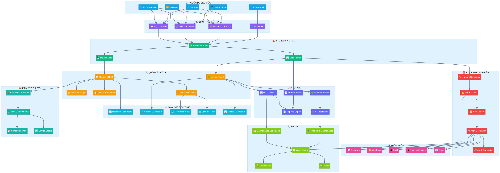
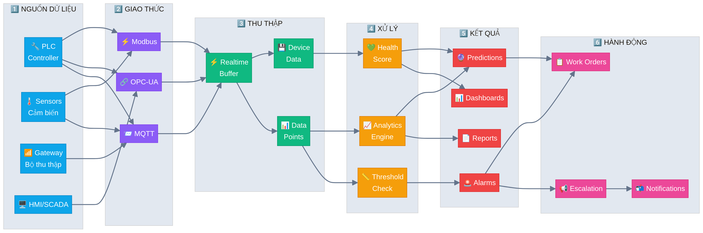

# Hướng Dẫn Sử Dụng Hệ Thống IoT

**Phiên bản:** 1.0  
**Ngày cập nhật:** 07/01/2026  
**Tác giả:** Manus AI

---

## Mục Lục

1. [Tổng Quan Hệ Thống IoT](#1-tổng-quan-hệ-thống-iot)
2. [Kiến Trúc Hệ Thống](#2-kiến-trúc-hệ-thống)
3. [Nguồn Dữ Liệu Gốc](#3-nguồn-dữ-liệu-gốc)
4. [Giao Thức Kết Nối](#4-giao-thức-kết-nối)
5. [Quản Lý Thiết Bị](#5-quản-lý-thiết-bị)
6. [Giám Sát Realtime](#6-giám-sát-realtime)
7. [Hệ Thống Cảnh Báo](#7-hệ-thống-cảnh-báo)
8. [Quản Lý Bảo Trì](#8-quản-lý-bảo-trì)
9. [Phân Tích và Báo Cáo](#9-phân-tích-và-báo-cáo)
10. [Firmware và OTA](#10-firmware-và-ota)
11. [Sơ Đồ Luồng Dữ Liệu](#11-sơ-đồ-luồng-dữ-liệu)

---

## 1. Tổng Quan Hệ Thống IoT

Hệ thống IoT (Internet of Things) trong CPK-SPC Calculator là một nền tảng toàn diện cho phép thu thập, giám sát và phân tích dữ liệu từ các thiết bị công nghiệp trong thời gian thực. Hệ thống được thiết kế để hỗ trợ quản lý thiết bị, theo dõi hiệu suất, cảnh báo sự cố và bảo trì dự đoán.

### 1.1 Các Chức Năng Chính

| Nhóm Chức Năng | Mô Tả | Đường Dẫn |
|----------------|-------|-----------|
| **Tổng Quan IoT** | Dashboard tổng hợp trạng thái thiết bị | `/iot-dashboard` |
| **Quản Lý Thiết Bị** | CRUD thiết bị, nhóm, template | `/iot-device-crud` |
| **Giám Sát Realtime** | Theo dõi dữ liệu thời gian thực | `/iot-realtime-dashboard` |
| **Cảnh Báo** | Quản lý alarm và threshold | `/iot-alarm-crud` |
| **Bảo Trì** | Work orders và lịch bảo trì | `/iot-work-orders` |
| **Phân Tích** | MTTR/MTBF và dự đoán AI | `/mttr-mtbf-report` |
| **Floor Plan** | Sơ đồ mặt bằng 2D/3D | `/iot-floor-plan` |
| **Firmware OTA** | Cập nhật firmware từ xa | `/iot-scheduled-ota` |

### 1.2 Quyền Truy Cập

Hệ thống phân quyền theo hai cấp độ chính:

- **User thường**: Xem dashboard, giám sát realtime, xem báo cáo
- **Admin**: Toàn quyền cấu hình thiết bị, threshold, kết nối protocol, firmware OTA

---

## 2. Kiến Trúc Hệ Thống

Hệ thống IoT được xây dựng theo kiến trúc phân lớp, bao gồm các thành phần chính sau:

### 2.1 Sơ Đồ Kiến Trúc Tổng Quan



### 2.2 Các Lớp Trong Hệ Thống

**Lớp 1 - Nguồn Dữ Liệu Gốc (Data Sources)**
Bao gồm các thiết bị vật lý như PLC, Sensors, Gateway, HMI/SCADA và các API bên ngoài. Đây là nơi sinh ra dữ liệu gốc của hệ thống.

**Lớp 2 - Giao Thức Kết Nối (Protocols)**
Hỗ trợ nhiều giao thức công nghiệp: MQTT, OPC-UA, Modbus TCP/RTU và REST API. Mỗi giao thức phù hợp với từng loại thiết bị và yêu cầu cụ thể.

**Lớp 3 - Thu Thập Dữ Liệu (Data Collection)**
Realtime Buffer nhận dữ liệu từ các giao thức, sau đó phân phối đến Data Points và Device Data để lưu trữ và xử lý.

**Lớp 4 - Quản Lý Thiết Bị (Device Management)**
Quản lý toàn bộ vòng đời thiết bị: đăng ký, cấu hình, nhóm, template, theo dõi sức khỏe và vị trí trên floor plan.

**Lớp 5 - Giám Sát và Phân Tích (Monitoring & Analytics)**
Cung cấp các dashboard realtime, phân tích MTTR/MTBF, dự đoán AI và xuất báo cáo.

**Lớp 6 - Cảnh Báo và Thông Báo (Alert & Notification)**
Hệ thống cảnh báo đa cấp với khả năng leo thang (escalation) và gửi thông báo qua nhiều kênh.

**Lớp 7 - Bảo Trì (Maintenance)**
Quản lý work orders, kỹ thuật viên, lịch bảo trì và bảo trì dự đoán.

---

## 3. Nguồn Dữ Liệu Gốc

### 3.1 Các Loại Thiết Bị Được Hỗ Trợ

| Loại Thiết Bị | Mô Tả | Giao Thức Phổ Biến |
|---------------|-------|-------------------|
| **PLC** | Programmable Logic Controller | OPC-UA, Modbus |
| **Sensor** | Cảm biến nhiệt độ, áp suất, độ ẩm... | MQTT, Modbus |
| **Gateway** | Thiết bị trung gian thu thập dữ liệu | MQTT, OPC-UA |
| **HMI** | Human Machine Interface | OPC-UA |
| **SCADA** | Supervisory Control and Data Acquisition | OPC-UA, REST API |
| **Other** | Các thiết bị khác | Tùy thuộc cấu hình |

### 3.2 Cấu Trúc Dữ Liệu Thiết Bị

Mỗi thiết bị trong hệ thống được định nghĩa với các thuộc tính sau:

```
- deviceCode: Mã thiết bị (duy nhất)
- deviceName: Tên thiết bị
- deviceType: Loại thiết bị (plc, sensor, gateway, hmi, scada, other)
- manufacturer: Nhà sản xuất
- model: Model thiết bị
- serialNumber: Số serial
- firmwareVersion: Phiên bản firmware
- productionLineId: ID dây chuyền sản xuất
- machineId: ID máy liên kết
- location: Vị trí lắp đặt
- ipAddress: Địa chỉ IP
- macAddress: Địa chỉ MAC
- status: Trạng thái (online, offline, error, maintenance)
```

### 3.3 Dữ Liệu Thu Thập

Dữ liệu từ thiết bị được thu thập theo cấu trúc Data Points:

| Trường | Mô Tả | Kiểu Dữ Liệu |
|--------|-------|--------------|
| `deviceId` | ID thiết bị nguồn | Integer |
| `tagName` | Tên tag/metric | String |
| `tagType` | Loại tag (analog, digital, string, counter) | Enum |
| `value` | Giá trị đo được | String |
| `timestamp` | Thời điểm đo | Timestamp |
| `quality` | Chất lượng dữ liệu | String |

---

## 4. Giao Thức Kết Nối

### 4.1 MQTT (Message Queuing Telemetry Transport)

MQTT là giao thức nhắn tin nhẹ, phù hợp cho các thiết bị IoT với băng thông hạn chế.

**Cấu hình kết nối MQTT:**

| Tham Số | Mô Tả | Giá Trị Mặc Định |
|---------|-------|------------------|
| `host` | Địa chỉ MQTT Broker | - |
| `port` | Cổng kết nối | 1883 |
| `clientId` | ID client | Auto-generated |
| `username` | Tên đăng nhập | Optional |
| `password` | Mật khẩu | Optional |
| `useTls` | Sử dụng TLS/SSL | false |
| `cleanSession` | Clean session | true |
| `keepAlive` | Keep alive interval (s) | 60 |
| `qos` | Quality of Service (0, 1, 2) | 1 |

**Cấu trúc Topic MQTT:**

```
iot/devices/{deviceId}/data/{metric}     - Dữ liệu metric
iot/devices/{deviceId}/status            - Trạng thái thiết bị
iot/devices/{deviceId}/alarm             - Cảnh báo
iot/devices/{deviceId}/command           - Lệnh điều khiển
```

**Hướng dẫn sử dụng:**

1. Truy cập **IoT → Connections → MQTT Connections** (`/mqtt-connections`)
2. Nhấn **Add Connection** để thêm kết nối mới
3. Điền thông tin Broker (host, port, credentials)
4. Chọn thiết bị cần kết nối
5. Cấu hình topics cần subscribe
6. Nhấn **Connect** để kết nối

### 4.2 OPC-UA (Open Platform Communications Unified Architecture)

OPC-UA là tiêu chuẩn công nghiệp cho trao đổi dữ liệu an toàn và đáng tin cậy.

**Cấu hình kết nối OPC-UA:**

| Tham Số | Mô Tả | Giá Trị Mặc Định |
|---------|-------|------------------|
| `endpointUrl` | URL endpoint OPC-UA | - |
| `host` | Địa chỉ server | localhost |
| `port` | Cổng kết nối | 4840 |
| `securityMode` | Chế độ bảo mật | None |
| `securityPolicy` | Policy bảo mật | None |
| `username` | Tên đăng nhập | Optional |
| `password` | Mật khẩu | Optional |
| `nodeIds` | Danh sách Node IDs cần đọc | [] |
| `samplingInterval` | Chu kỳ lấy mẫu (ms) | 1000 |

**Hướng dẫn sử dụng:**

1. Truy cập **IoT → Connections → OPC-UA Connections** (`/opcua-connections`)
2. Nhấn **Add Connection**
3. Nhập Endpoint URL của OPC-UA Server
4. Cấu hình Security Mode nếu cần
5. Thêm Node IDs cần theo dõi
6. Nhấn **Connect**

### 4.3 Modbus TCP/RTU

Modbus là giao thức truyền thông công nghiệp phổ biến cho PLC và các thiết bị tự động hóa.

**Cấu hình Modbus TCP:**

| Tham Số | Mô Tả | Giá Trị Mặc Định |
|---------|-------|------------------|
| `host` | Địa chỉ IP | - |
| `port` | Cổng TCP | 502 |
| `unitId` | Unit ID (Slave ID) | 1 |

**Cấu hình Modbus RTU:**

| Tham Số | Mô Tả | Giá Trị Mặc Định |
|---------|-------|------------------|
| `baudRate` | Tốc độ baud | 9600 |
| `dataBits` | Data bits | 8 |
| `stopBits` | Stop bits | 1 |
| `parity` | Parity (none, even, odd) | none |

**Loại Register Modbus:**

| Loại | Địa Chỉ | Quyền | Mô Tả |
|------|---------|-------|-------|
| Coil | 00001-09999 | Read/Write | Digital outputs |
| Discrete Input | 10001-19999 | Read Only | Digital inputs |
| Input Register | 30001-39999 | Read Only | Analog inputs |
| Holding Register | 40001-49999 | Read/Write | Analog outputs |

---

## 5. Quản Lý Thiết Bị

### 5.1 Quản Lý Thiết Bị (Device CRUD)

**Đường dẫn:** `/iot-device-crud`

Chức năng này cho phép quản lý toàn bộ vòng đời thiết bị IoT trong hệ thống.

**Các thao tác chính:**

| Thao Tác | Mô Tả | Quyền |
|----------|-------|-------|
| **Thêm thiết bị** | Đăng ký thiết bị mới vào hệ thống | Admin |
| **Sửa thiết bị** | Cập nhật thông tin thiết bị | Admin |
| **Xóa thiết bị** | Xóa thiết bị khỏi hệ thống | Admin |
| **Xem danh sách** | Xem và tìm kiếm thiết bị | User/Admin |
| **Lọc theo trạng thái** | Lọc thiết bị theo online/offline/error | User/Admin |

**Quy trình thêm thiết bị mới:**

1. Truy cập **IoT → Overview → Device Management**
2. Nhấn nút **Add Device**
3. Điền thông tin bắt buộc:
   - Device Code (mã duy nhất)
   - Device Name
   - Device Type
4. Điền thông tin tùy chọn:
   - Manufacturer, Model, Serial Number
   - IP Address, MAC Address
   - Production Line, Machine liên kết
5. Nhấn **Save** để lưu

### 5.2 Nhóm Thiết Bị (Device Groups)

Hệ thống hỗ trợ phân nhóm thiết bị theo cấu trúc phân cấp để dễ dàng quản lý.

**Cấu trúc nhóm:**

```
- Nhà máy A
  ├── Dây chuyền 1
  │   ├── Khu vực lắp ráp
  │   └── Khu vực kiểm tra
  └── Dây chuyền 2
      ├── Khu vực đóng gói
      └── Khu vực kho
```

**Thuộc tính nhóm:**

| Trường | Mô Tả |
|--------|-------|
| `name` | Tên nhóm |
| `description` | Mô tả |
| `parentGroupId` | ID nhóm cha (nếu có) |
| `location` | Vị trí |
| `metadata` | Thông tin bổ sung |

### 5.3 Template Thiết Bị (Device Templates)

Template giúp tạo nhanh thiết bị với cấu hình định sẵn.

**Sử dụng Template:**

1. Tạo template với các thuộc tính mặc định
2. Khi thêm thiết bị mới, chọn template
3. Hệ thống tự động điền các thuộc tính từ template
4. Chỉnh sửa nếu cần và lưu

### 5.4 Theo Dõi Sức Khỏe Thiết Bị (Device Health)

Hệ thống tự động tính toán và theo dõi các chỉ số sức khỏe thiết bị:

| Chỉ Số | Mô Tả | Công Thức |
|--------|-------|-----------|
| **Health Score** | Điểm sức khỏe tổng hợp | Trung bình có trọng số |
| **Availability Score** | Độ khả dụng | (Uptime / Total Time) × 100 |
| **Performance Score** | Hiệu suất | (Actual Output / Expected Output) × 100 |
| **Reliability Score** | Độ tin cậy | Dựa trên MTBF |
| **Data Quality Score** | Chất lượng dữ liệu | (Valid Data / Total Data) × 100 |

---

## 6. Giám Sát Realtime

### 6.1 Dashboard Tổng Quan IoT

**Đường dẫn:** `/iot-dashboard`

Dashboard hiển thị tổng quan trạng thái toàn bộ hệ thống IoT:

- **Thống kê thiết bị:** Tổng số, online, offline, error, maintenance
- **Biểu đồ trạng thái:** Phân bố thiết bị theo trạng thái
- **Cảnh báo gần đây:** Danh sách alarm mới nhất
- **Thiết bị có vấn đề:** Danh sách thiết bị cần chú ý

### 6.2 Dashboard Realtime

**Đường dẫn:** `/iot-realtime-dashboard`

Hiển thị dữ liệu realtime từ các thiết bị:

- **Biểu đồ thời gian thực:** Cập nhật liên tục theo chu kỳ
- **Giá trị hiện tại:** Hiển thị giá trị mới nhất của các metric
- **Ngưỡng cảnh báo:** Hiển thị đường ngưỡng trên biểu đồ
- **Lịch sử ngắn hạn:** Dữ liệu 1-24 giờ gần nhất

### 6.3 Sensor Dashboard

**Đường dẫn:** `/sensor-dashboard`

Dashboard chuyên biệt cho các cảm biến:

- **Danh sách sensor:** Hiển thị tất cả sensor với giá trị hiện tại
- **Biểu đồ gauge:** Hiển thị giá trị dạng đồng hồ
- **Trend chart:** Xu hướng giá trị theo thời gian
- **Trạng thái kết nối:** Online/Offline status

### 6.4 Floor Plan View (Sơ Đồ Mặt Bằng 2D)

**Đường dẫn:** `/iot-floor-plan`

Hiển thị vị trí thiết bị trên sơ đồ mặt bằng nhà máy:

**Các tính năng:**

- **Upload hình ảnh mặt bằng:** Hỗ trợ PNG, JPG, SVG
- **Đặt thiết bị lên bản đồ:** Kéo thả thiết bị vào vị trí
- **Phân vùng (Zones):** Chia mặt bằng thành các khu vực
- **Hiển thị trạng thái:** Màu sắc thiết bị theo trạng thái
- **Click để xem chi tiết:** Popup thông tin thiết bị

**Loại Zone:**

| Loại | Mô Tả |
|------|-------|
| `production` | Khu vực sản xuất |
| `warehouse` | Kho hàng |
| `office` | Văn phòng |
| `maintenance` | Khu bảo trì |
| `restricted` | Khu vực hạn chế |
| `common` | Khu vực chung |

### 6.5 Floor Plan 3D

**Đường dẫn:** `/iot-3d-floor-plan`

Hiển thị mặt bằng dạng 3D với các model thiết bị:

- **Import 3D models:** Hỗ trợ GLTF/GLB format
- **Đặt model vào scene:** Định vị X, Y, Z
- **Xoay và scale:** Điều chỉnh hướng và kích thước
- **Liên kết với thiết bị:** Gắn model với IoT device
- **Animation:** Hiệu ứng khi có cảnh báo

### 6.6 Unified Dashboard

**Đường dẫn:** `/iot-unified-dashboard`

Dashboard tùy chỉnh với các widget có thể kéo thả:

**Loại Widget:**

| Widget | Mô Tả |
|--------|-------|
| `device_status` | Trạng thái thiết bị |
| `health_score` | Điểm sức khỏe |
| `alerts` | Danh sách cảnh báo |
| `chart` | Biểu đồ dữ liệu |
| `map` | Bản đồ/Floor plan |
| `kpi` | Chỉ số KPI |
| `custom` | Widget tùy chỉnh |

---

## 7. Hệ Thống Cảnh Báo

### 7.1 Quản Lý Alarm

**Đường dẫn:** `/iot-alarm-crud`

Hệ thống alarm theo dõi và ghi nhận các sự cố từ thiết bị.

**Loại Alarm:**

| Loại | Mức Độ | Mô Tả |
|------|--------|-------|
| `warning` | Thấp | Cảnh báo nhẹ, cần theo dõi |
| `error` | Trung bình | Lỗi cần xử lý |
| `critical` | Cao | Nghiêm trọng, cần xử lý ngay |

**Vòng đời Alarm:**

```
Created → Acknowledged → Resolved
           ↓
        Escalated (nếu không được xử lý)
```

**Các thao tác với Alarm:**

1. **Acknowledge:** Xác nhận đã biết alarm
2. **Resolve:** Đánh dấu đã xử lý xong
3. **Batch Acknowledge:** Xác nhận nhiều alarm cùng lúc

### 7.2 Cấu Hình Threshold (Ngưỡng Cảnh Báo)

**Đường dẫn:** `/alarm-threshold-config`

Cấu hình ngưỡng để tự động tạo alarm khi giá trị vượt ngưỡng.

**Các mức ngưỡng:**

| Mức | Trường | Mô Tả |
|-----|--------|-------|
| Warning Lower | `warningLowerLimit` | Ngưỡng warning dưới |
| Warning Upper | `warningUpperLimit` | Ngưỡng warning trên |
| Critical Lower | `criticalLowerLimit` | Ngưỡng critical dưới |
| Critical Upper | `criticalUpperLimit` | Ngưỡng critical trên |

**Ví dụ cấu hình:**

```
Metric: Temperature
Warning Lower: 15°C
Warning Upper: 35°C
Critical Lower: 10°C
Critical Upper: 40°C
```

### 7.3 Alert Escalation (Leo Thang Cảnh Báo)

**Đường dẫn:** `/webhook-escalation`

Hệ thống tự động leo thang cảnh báo nếu không được xử lý trong thời gian quy định.

**Cấu hình Escalation Rule:**

| Trường | Mô Tả |
|--------|-------|
| `name` | Tên rule |
| `alertType` | Loại alert áp dụng |
| `severityFilter` | Lọc theo mức độ |
| `deviceFilter` | Lọc theo thiết bị |
| `escalationLevels` | Các cấp leo thang |
| `cooldownMinutes` | Thời gian chờ giữa các lần |

**Ví dụ Escalation Levels:**

| Level | Delay | Channels | Recipients |
|-------|-------|----------|------------|
| 1 | 5 phút | Email, Push | Kỹ thuật viên |
| 2 | 15 phút | Email, SMS | Supervisor |
| 3 | 30 phút | Email, SMS, Call | Manager |

### 7.4 Alert Correlation (Tương Quan Cảnh Báo)

Hệ thống nhận diện và xử lý các alarm liên quan:

**Loại Action:**

| Action | Mô Tả |
|--------|-------|
| `suppress` | Ẩn alarm phụ thuộc |
| `merge` | Gộp các alarm liên quan |
| `escalate` | Leo thang khi có nhiều alarm |
| `notify` | Gửi thông báo tổng hợp |

### 7.5 Kênh Thông Báo

Hệ thống hỗ trợ nhiều kênh gửi thông báo:

| Kênh | Đường Dẫn Cấu Hình | Mô Tả |
|------|-------------------|-------|
| **Telegram** | `/telegram-settings` | Bot Telegram |
| **Webhook** | `/alert-webhook-settings` | Slack, Teams, Discord |
| **SMS** | `/sms-settings` | Twilio, Nexmo |
| **Push** | `/notification-preferences` | Firebase Push |
| **Email** | Cấu hình hệ thống | SMTP Email |

---

## 8. Quản Lý Bảo Trì

### 8.1 Work Orders (Lệnh Công Việc)

**Đường dẫn:** `/iot-work-orders`

Work Order là đơn vị quản lý công việc bảo trì trong hệ thống.

**Loại Work Order:**

| Loại | Mô Tả |
|------|-------|
| `predictive` | Bảo trì dự đoán (từ AI) |
| `preventive` | Bảo trì định kỳ |
| `corrective` | Sửa chữa sau sự cố |
| `emergency` | Khẩn cấp |
| `inspection` | Kiểm tra định kỳ |

**Trạng thái Work Order:**

```
created → assigned → in_progress → completed → verified
                  ↓
               on_hold
                  ↓
              cancelled
```

**Quy trình tạo Work Order:**

1. Truy cập **IoT → Maintenance → Work Orders**
2. Nhấn **Create Work Order**
3. Điền thông tin:
   - Title, Description
   - Device liên quan
   - Loại work order
   - Priority (low, medium, high, critical)
   - Estimated duration
   - Due date
4. Gán cho kỹ thuật viên (hoặc dùng Auto-assign)
5. Thêm Tasks nếu cần
6. Nhấn **Save**

### 8.2 Tasks (Công Việc Con)

Mỗi Work Order có thể chứa nhiều Tasks:

| Trường | Mô Tả |
|--------|-------|
| `title` | Tên task |
| `description` | Mô tả chi tiết |
| `estimatedDuration` | Thời gian ước tính |
| `assignedTo` | Người thực hiện |
| `checklistItems` | Danh sách kiểm tra |
| `requiredTools` | Dụng cụ cần thiết |
| `safetyPrecautions` | Lưu ý an toàn |

### 8.3 Technicians (Kỹ Thuật Viên)

Quản lý thông tin kỹ thuật viên:

| Trường | Mô Tả |
|--------|-------|
| `employeeId` | Mã nhân viên |
| `department` | Phòng ban |
| `skills` | Kỹ năng (electrical, mechanical, plc, hvac...) |
| `certifications` | Chứng chỉ |
| `availability` | Trạng thái sẵn sàng |
| `currentWorkload` | Khối lượng công việc hiện tại |

**Auto-assign Logic:**

Hệ thống tự động gán work order dựa trên:
1. Kỹ năng phù hợp với yêu cầu
2. Availability của kỹ thuật viên
3. Workload hiện tại
4. Vị trí gần thiết bị

### 8.4 Maintenance Schedules (Lịch Bảo Trì)

**Đường dẫn:** Quản lý trong Device Management

Cấu hình lịch bảo trì định kỳ cho thiết bị:

| Loại | Mô Tả |
|------|-------|
| `preventive` | Bảo trì phòng ngừa |
| `corrective` | Sửa chữa |
| `predictive` | Dự đoán |
| `calibration` | Hiệu chuẩn |
| `inspection` | Kiểm tra |

**Tần suất:**

- Daily (hàng ngày)
- Weekly (hàng tuần)
- Monthly (hàng tháng)
- Quarterly (hàng quý)
- Yearly (hàng năm)
- Custom (tùy chỉnh theo số ngày)

### 8.5 Predictive Maintenance (Bảo Trì Dự Đoán)

**Đường dẫn:** `/predictive-maintenance` (trong MMS)

Sử dụng AI để dự đoán thời điểm cần bảo trì:

**Loại Prediction Model:**

| Model | Mô Tả |
|-------|-------|
| `health_decay` | Dự đoán suy giảm sức khỏe |
| `failure_prediction` | Dự đoán hỏng hóc |
| `anomaly_detection` | Phát hiện bất thường |
| `remaining_life` | Tuổi thọ còn lại |
| `maintenance_scheduling` | Lập lịch bảo trì tối ưu |

**Quy trình:**

1. Cấu hình Prediction Model
2. Chọn thiết bị/nhóm thiết bị áp dụng
3. Định nghĩa input features (metrics)
4. Chạy phân tích
5. Xem kết quả dự đoán
6. Tạo Work Order từ prediction

---

## 9. Phân Tích và Báo Cáo

### 9.1 MTTR/MTBF Analysis

**Đường dẫn:** `/mttr-mtbf-report`

Phân tích hai chỉ số quan trọng về độ tin cậy thiết bị:

**MTTR (Mean Time To Repair):**
> Thời gian trung bình để sửa chữa một sự cố

```
MTTR = Tổng thời gian sửa chữa / Số lần sửa chữa
```

**MTBF (Mean Time Between Failures):**
> Thời gian trung bình giữa các lần hỏng hóc

```
MTBF = Tổng thời gian hoạt động / Số lần hỏng hóc
```

**Các chỉ số bổ sung:**

| Chỉ Số | Công Thức | Ý Nghĩa |
|--------|-----------|---------|
| **Availability** | MTBF / (MTBF + MTTR) | Độ khả dụng |
| **Failure Rate** | 1 / MTBF | Tỷ lệ hỏng hóc |
| **Reliability** | e^(-t/MTBF) | Độ tin cậy tại thời điểm t |

### 9.2 MTTR/MTBF Comparison

**Đường dẫn:** `/mttr-mtbf-comparison`

So sánh MTTR/MTBF giữa các thiết bị, máy móc hoặc dây chuyền:

**Các tùy chọn so sánh:**

| Target Type | Mô Tả |
|-------------|-------|
| `device` | So sánh giữa các thiết bị IoT |
| `machine` | So sánh giữa các máy |
| `production_line` | So sánh giữa các dây chuyền |

**Export báo cáo:**

- Excel (.xlsx)
- PDF

### 9.3 MTTR/MTBF Thresholds

**Đường dẫn:** `/mttr-mtbf-thresholds`

Cấu hình ngưỡng cảnh báo cho MTTR/MTBF:

| Ngưỡng | Mô Tả |
|--------|-------|
| `mttrWarning` | MTTR vượt ngưỡng warning |
| `mttrCritical` | MTTR vượt ngưỡng critical |
| `mtbfWarning` | MTBF dưới ngưỡng warning |
| `mtbfCritical` | MTBF dưới ngưỡng critical |

### 9.4 MTTR/MTBF Prediction

**Đường dẫn:** `/mttr-mtbf-prediction`

Dự đoán xu hướng MTTR/MTBF trong tương lai sử dụng AI.

### 9.5 Health Analysis

Phân tích sức khỏe thiết bị theo thời gian:

- **Trend Analysis:** Xu hướng các chỉ số
- **Anomaly Detection:** Phát hiện bất thường
- **Correlation Analysis:** Tương quan giữa các metrics

### 9.6 Reports Export

Xuất báo cáo với nhiều định dạng:

| Định Dạng | Mô Tả |
|-----------|-------|
| Excel | Dữ liệu chi tiết, có thể chỉnh sửa |
| PDF | Báo cáo định dạng chuẩn |

---

## 10. Firmware và OTA

### 10.1 Firmware Packages

**Đường dẫn:** `/iot-scheduled-ota` (Admin)

Quản lý các gói firmware cho thiết bị:

| Trường | Mô Tả |
|--------|-------|
| `name` | Tên gói firmware |
| `version` | Phiên bản |
| `deviceType` | Loại thiết bị áp dụng |
| `manufacturer` | Nhà sản xuất |
| `model` | Model thiết bị |
| `fileUrl` | URL file firmware |
| `fileSize` | Kích thước file |
| `checksum` | Mã checksum (MD5/SHA) |
| `releaseNotes` | Ghi chú phát hành |
| `minRequiredVersion` | Phiên bản tối thiểu yêu cầu |
| `isStable` | Phiên bản ổn định |
| `isBeta` | Phiên bản beta |

**Quy trình upload firmware:**

1. Truy cập **IoT → Maintenance → Scheduled OTA**
2. Nhấn **Upload Firmware**
3. Chọn file firmware
4. Điền thông tin version, release notes
5. Hệ thống tự động tính checksum
6. Nhấn **Save**

### 10.2 OTA Deployments

Triển khai firmware đến thiết bị:

**Loại Deployment:**

| Loại | Mô Tả |
|------|-------|
| `immediate` | Triển khai ngay lập tức |
| `scheduled` | Lên lịch triển khai |
| `phased` | Triển khai theo giai đoạn |

**Trạng thái Deployment:**

```
created → in_progress → completed
              ↓
           paused
              ↓
          cancelled
```

**Trạng thái Device trong OTA:**

| Status | Mô Tả |
|--------|-------|
| `pending` | Chờ cập nhật |
| `downloading` | Đang tải firmware |
| `installing` | Đang cài đặt |
| `verifying` | Đang xác minh |
| `completed` | Hoàn thành |
| `failed` | Thất bại |
| `rolled_back` | Đã rollback |

### 10.3 Scheduled OTA

Lên lịch cập nhật firmware tự động:

| Trường | Mô Tả |
|--------|-------|
| `name` | Tên schedule |
| `firmwarePackageId` | Gói firmware |
| `targetDeviceIds` | Danh sách thiết bị |
| `scheduleType` | Loại (once, recurring) |
| `scheduledTime` | Thời gian thực hiện |
| `recurringPattern` | Mẫu lặp lại (nếu recurring) |
| `maintenanceWindow` | Cửa sổ bảo trì |
| `maxConcurrent` | Số thiết bị cập nhật đồng thời |
| `rollbackOnFailure` | Tự động rollback khi lỗi |

---

## 11. Sơ Đồ Luồng Dữ Liệu

### 11.1 Luồng Dữ Liệu Chính

```
┌─────────────────────────────────────────────────────────────────────────────┐
│                           NGUỒN DỮ LIỆU GỐC                                  │
│  ┌─────────┐  ┌─────────┐  ┌─────────┐  ┌─────────┐  ┌─────────┐           │
│  │   PLC   │  │ Sensors │  │ Gateway │  │   HMI   │  │External │           │
│  └────┬────┘  └────┬────┘  └────┬────┘  └────┬────┘  └────┬────┘           │
└───────┼────────────┼────────────┼────────────┼────────────┼─────────────────┘
        │            │            │            │            │
        ▼            ▼            ▼            ▼            ▼
┌─────────────────────────────────────────────────────────────────────────────┐
│                         GIAO THỨC KẾT NỐI                                    │
│  ┌─────────┐  ┌─────────┐  ┌─────────┐  ┌─────────┐                         │
│  │  MQTT   │  │ OPC-UA  │  │ Modbus  │  │REST API │                         │
│  └────┬────┘  └────┬────┘  └────┬────┘  └────┬────┘                         │
└───────┼────────────┼────────────┼────────────┼──────────────────────────────┘
        │            │            │            │
        └────────────┴────────────┴────────────┘
                            │
                            ▼
┌─────────────────────────────────────────────────────────────────────────────┐
│                         THU THẬP DỮ LIỆU                                     │
│                    ┌──────────────────┐                                      │
│                    │  Realtime Buffer │                                      │
│                    └────────┬─────────┘                                      │
│                             │                                                │
│              ┌──────────────┴──────────────┐                                │
│              ▼                             ▼                                │
│       ┌────────────┐               ┌────────────┐                           │
│       │ Data Points│               │Device Data │                           │
│       └──────┬─────┘               └──────┬─────┘                           │
└──────────────┼────────────────────────────┼─────────────────────────────────┘
               │                            │
    ┌──────────┴──────────┐                 │
    ▼                     ▼                 ▼
┌────────────┐    ┌────────────┐    ┌────────────────┐
│ Thresholds │    │  Analytics │    │Device Management│
│  Config    │    │  Engine    │    │                │
└─────┬──────┘    └─────┬──────┘    └───────┬────────┘
      │                 │                   │
      ▼                 ▼                   ▼
┌────────────┐    ┌────────────┐    ┌────────────────┐
│   Alarms   │    │ MTTR/MTBF  │    │   Dashboards   │
│            │    │ Predictions│    │   Floor Plans  │
└─────┬──────┘    └─────┬──────┘    └────────────────┘
      │                 │
      ▼                 ▼
┌────────────┐    ┌────────────┐
│ Escalation │    │Work Orders │
│            │    │            │
└─────┬──────┘    └────────────┘
      │
      ▼
┌────────────────────────────────────────────────────┐
│                   THÔNG BÁO                         │
│  ┌────────┐ ┌────────┐ ┌────────┐ ┌────────┐       │
│  │Telegram│ │Webhook │ │  SMS   │ │ Email  │       │
│  └────────┘ └────────┘ └────────┘ └────────┘       │
└────────────────────────────────────────────────────┘
```

### 11.2 Mối Quan Hệ Giữa Các Module

| Module Nguồn | Module Đích | Quan Hệ |
|--------------|-------------|---------|
| Data Points | Thresholds | Kiểm tra ngưỡng |
| Thresholds | Alarms | Tạo alarm khi vượt ngưỡng |
| Alarms | Escalation | Leo thang nếu không xử lý |
| Escalation | Notifications | Gửi thông báo |
| Alarms | Work Orders | Tạo work order từ alarm |
| Predictions | Work Orders | Tạo work order dự đoán |
| Device Health | Analytics | Phân tích sức khỏe |
| Analytics | Predictions | Input cho AI |
| Devices | Floor Plans | Hiển thị vị trí |
| Devices | Firmware OTA | Cập nhật firmware |

---

## Phụ Lục

### A. Danh Sách Đường Dẫn Chức Năng

| Chức Năng | Đường Dẫn | Quyền |
|-----------|-----------|-------|
| IoT Dashboard | `/iot-dashboard` | User |
| IoT Overview Dashboard | `/iot-overview-dashboard` | User |
| Device Management | `/iot-device-crud` | User/Admin |
| Alarm Management | `/iot-alarm-crud` | User/Admin |
| Realtime Dashboard | `/iot-realtime-dashboard` | User |
| Monitoring Realtime | `/iot-monitoring-realtime` | User |
| Sensor Dashboard | `/sensor-dashboard` | User |
| Floor Plan 2D | `/iot-floor-plan` | User |
| Floor Plan 3D | `/iot-3d-floor-plan` | User |
| Floor Plan Designer | `/floor-plan-designer` | Admin |
| 3D Model Management | `/model-3d-management` | Admin |
| Unified Dashboard | `/iot-unified-dashboard` | User |
| Work Orders | `/iot-work-orders` | User/Admin |
| Scheduled OTA | `/iot-scheduled-ota` | Admin |
| MTTR/MTBF Report | `/mttr-mtbf-report` | User |
| MTTR/MTBF Comparison | `/mttr-mtbf-comparison` | User |
| MTTR/MTBF Thresholds | `/mttr-mtbf-thresholds` | Admin |
| MTTR/MTBF Prediction | `/mttr-mtbf-prediction` | User |
| IoT Gateway | `/iot-gateway` | Admin |
| MQTT Connections | `/mqtt-connections` | Admin |
| OPC-UA Connections | `/opcua-connections` | Admin |
| Alarm Threshold Config | `/alarm-threshold-config` | Admin |
| Realtime Machine Config | `/realtime-machine-config` | Admin |
| Realtime History | `/realtime-history` | User |
| Telegram Settings | `/telegram-settings` | Admin |
| Alert Webhook Settings | `/alert-webhook-settings` | Admin |
| Webhook Escalation | `/webhook-escalation` | Admin |
| SMS Settings | `/sms-settings` | Admin |
| Escalation Dashboard | `/escalation-dashboard` | Admin |
| Auto Resolve Settings | `/auto-resolve-settings` | Admin |
| Latency Monitoring | `/latency-monitoring` | Admin |
| Notification Preferences | `/notification-preferences` | User |
| Work Order Notification Config | `/work-order-notification-config` | Admin |
| IoT User Guide | `/iot-user-guide` | User |

### B. Glossary (Thuật Ngữ)

| Thuật Ngữ | Định Nghĩa |
|-----------|------------|
| **IoT** | Internet of Things - Mạng lưới các thiết bị kết nối internet |
| **PLC** | Programmable Logic Controller - Bộ điều khiển logic khả trình |
| **HMI** | Human Machine Interface - Giao diện người-máy |
| **SCADA** | Supervisory Control and Data Acquisition |
| **MQTT** | Message Queuing Telemetry Transport - Giao thức nhắn tin IoT |
| **OPC-UA** | Open Platform Communications Unified Architecture |
| **Modbus** | Giao thức truyền thông công nghiệp |
| **MTTR** | Mean Time To Repair - Thời gian sửa chữa trung bình |
| **MTBF** | Mean Time Between Failures - Thời gian giữa các lần hỏng |
| **OTA** | Over-The-Air - Cập nhật từ xa qua mạng |
| **Threshold** | Ngưỡng cảnh báo |
| **Escalation** | Leo thang cảnh báo |
| **Work Order** | Lệnh công việc bảo trì |

---

**Tài liệu này được tạo tự động bởi Manus AI**  
**Phiên bản:** 1.0 | **Ngày:** 07/01/2026


---

## Phụ Lục C: Sơ Đồ Luồng Dữ Liệu Chi Tiết

### Sơ Đồ Luồng Dữ Liệu Từ Nguồn Đến Hành Động



**Giải thích các lớp trong sơ đồ:**

| Lớp | Tên | Mô Tả |
|-----|-----|-------|
| 1️⃣ | **Nguồn Dữ Liệu** | PLC, Sensors, Gateway, HMI/SCADA - nơi sinh ra dữ liệu gốc |
| 2️⃣ | **Giao Thức** | MQTT, OPC-UA, Modbus - phương thức truyền dữ liệu |
| 3️⃣ | **Thu Thập** | Realtime Buffer, Data Points, Device Data - lưu trữ tạm và xử lý |
| 4️⃣ | **Xử Lý** | Threshold Check, Health Score, Analytics Engine - phân tích dữ liệu |
| 5️⃣ | **Kết Quả** | Alarms, Dashboards, Reports, Predictions - output của hệ thống |
| 6️⃣ | **Hành Động** | Escalation, Work Orders, Notifications - phản hồi tự động |

### Mô Tả Chi Tiết Luồng Dữ Liệu

**Bước 1: Thu thập từ nguồn**
Dữ liệu được sinh ra từ các thiết bị vật lý (PLC, Sensors, Gateway, HMI/SCADA) trong nhà máy.

**Bước 2: Truyền qua giao thức**
Dữ liệu được truyền qua các giao thức công nghiệp tiêu chuẩn (MQTT cho IoT, OPC-UA cho tự động hóa, Modbus cho PLC).

**Bước 3: Thu thập và lưu trữ**
Realtime Buffer nhận dữ liệu và phân phối đến Data Points (dữ liệu metric) và Device Data (thông tin thiết bị).

**Bước 4: Xử lý và phân tích**
- **Threshold Check**: Kiểm tra giá trị có vượt ngưỡng cảnh báo
- **Health Score**: Tính toán điểm sức khỏe thiết bị
- **Analytics Engine**: Phân tích xu hướng và pattern

**Bước 5: Tạo kết quả**
- **Alarms**: Cảnh báo khi vượt ngưỡng
- **Dashboards**: Hiển thị trực quan
- **Reports**: Báo cáo phân tích
- **Predictions**: Dự đoán AI

**Bước 6: Thực hiện hành động**
- **Escalation**: Leo thang cảnh báo nếu không xử lý
- **Work Orders**: Tạo lệnh công việc bảo trì
- **Notifications**: Gửi thông báo qua các kênh (Telegram, SMS, Email, Push)

---

*Tài liệu này là phần bổ sung cho Hướng Dẫn Sử Dụng Hệ Thống IoT*
